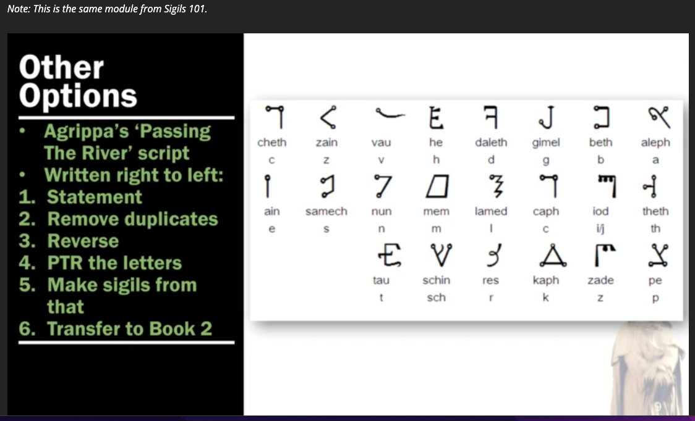

# Transitus Fluvii（川を渡る者）を使用した、シジル生成（試作版）

このプロトコルでは、ゴードン・ホワイト氏によるオンライン講座 *Sigils 101* 内の講義モジュールに登場する文字体系（Agrippa's "Passing the River" Script）を参照しています。

 

 

> ⚠️ **注意事項**  
>本プロトコルは、Gordon White氏のRune Soupメンバー限定コース「Sigils 101」内のレッスン受講中に得られた情報をもとに、個人の学習・整理目的で再構成したものです。内容の正確性・適合性は保証されません。実践はすべて自己責任でお願いします。
> 
> ⚠️ **Disclaimer**  
>This protocol is a personal reconstruction based on lessons from Gordon White’s Rune Soup member course *Sigils 101*. It is shared for educational and reference purposes only. Accuracy is not guaranteed. Use at your own risk.
>
> **出典**: Gordon White, *Sigils 101*, Rune Soup Member Course  
> This image is used under fair use for non-commercial educational purposes. All rights reserved to the original author.

### 📚 内容一覧

- シジル生成の手順を日本語で解説
- Transitus Fluviiのアルファベット対応表
- シジル生成の具体例
- Spare式との統合応用／Rune Soupとの接続アイデア

### 🔮 目的

このプロジェクトは、現代の魔術実践において古典的な文字体系を創造的かつ柔軟に活用し、オリジナルのシジル構築力を高めることを目指します。

---

### 手順の概要

1. 願望文（intent）を記述
2. 重複文字を削除
3. 文字を逆順に並び替え
4. Transitus Fluvii文字に変換
5. デザイン化してシジルに仕上げる
6. 清書する紙に記録して活性化

---

### 1. 願望文（intent）を記述

I wish to obtain the Necronomicon

### 2. 重複する文字を削除する
同じアルファベットが複数回出てきた場合は、1つだけ残して他は削除します。

I WISH TO OBTAIN THE NECRONOMICON
↓
IWSHTOBANECRM

---

### 3. 文字列を反転する
右から左に書き直します。これはTransitus Fluviiが右→左のスクリプトであるためです。

MRCENABTOHSWI

### 4. Transitus Fluvii文字に変換
アルファベットをTransitus Fluviiの文字に置き換えます。
下記のチャート（Agrippa's Script）を参照。

 

 

画像出典: Gordon White, Sigils 101 course (Rune Soup Member Course Module).
引用目的で掲載。全著作権は著者に帰属します。This image is used under educational/fair use principles for reference purposes only. All rights belong to the original creator.

### 4.1 🔤 英語アルファベットと Transitus Fluvii の変換ルール

Transitus Fluvii はヘブライ文字に基づいた魔術的スクリプトであり、英語アルファベットとは一対一の対応が存在しません。したがって、以下のように **音価や構造的な近似による柔軟な変換** を行います。

### 4.2 ✅ 推奨変換ルール

| 英字 | 対応文字 | 備考 |
|------|-----------|------|
| C    | S または K | Samech または Caph に対応 |
| J    | I         | Iod に統合される音価として処理 |
| Q    | K         | Caph に統合される |
| V    | V         | Vau にそのまま対応（u/v 同一視） |
| W    | V         | 二重 U として V に統合する |
| X    | K + S     | Caph + Samech として構成 |
| Y    | I         | Iod に吸収されるケースが多い |

### 4.3 補足

- **Transitus Fluvii** は右から左に書かれるスクリプトです。
- 曖昧な文字は「魔術的裁量」によって削除または調整して構いません。
- **目的は整合性よりも意図と効果**です。

---

### 5. 組み合わせてピクトリアルなシジルにする
変換した文字を自由な構成で重ねたりつなげたりして、視覚的に美しい「シジル」を作ります。

---

### 6. 清書する紙（魔術ノートなど）へ転記

完成したシジルをグリモア、魔術日誌、ノートなどに転記します。
活性化の儀式に使用したり、夢の中で作用させるのも良いです。

---

### 💡Tips
- 説明のため「I wish to...」形式で願望文の作成を行いましたが、基本は**肯定的な現在形の文**です。
- フォントが複雑な場合は手書きで対応しても問題ありません。
- Spare方式のシジル（自由造形）と組み合わせることで、より個人的なスタイルに発展させられます。

---

### 🪬 参考
- Agrippa, *Three Books of Occult Philosophy*, Book III.
- Rune Soup: [Sigils 101](https://runesoup.com/member-courses/)
- Gordon White, *The Chaos Protocols*

---

### 📎 関連リンク
- Rune Soup: https://runesoup.com/member-courses/
- Agrippa, *Three Books of Occult Philosophy* (Book III)
- Gordon White, *The Chaos Protocols*

---
## 🐌 こちらもご覧ください

このページは、作成済み、制作途中、制作予定のものに簡単にアクセスできるメインメニューです。
大量の情報が見やすく表示されています。

[📚 Le Sorcier Inconnuの書架──翻訳と注釈の目録](https://github.com/ravensgate-tux/sorcier_catalogue/blob/main/README.md)

---

### 🧪 ライセンスと今後の展開
このプロジェクトはMITライセンス下で公開予定です。将来的にはGUI補助ツール（ブラウザ描画など）との統合も検討しています。

---

© 2025 知られざる呪術師（Le Sorcier Inconnu）  
本ドキュメントは [Creative Commons BY-SA 4.0](https://creativecommons.org/licenses/by-sa/4.0/deed.ja) に基づき公開されています。
